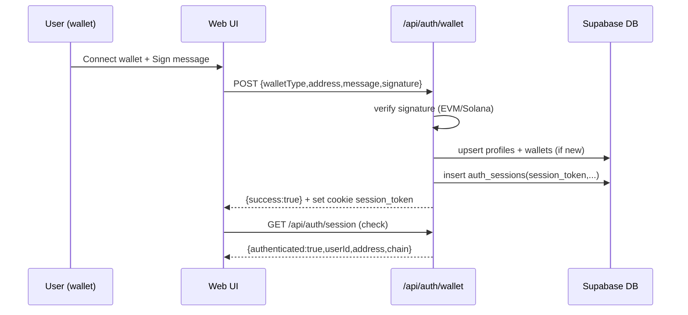

## E2E Flow Report — Auth (Login/Sign-in) + Referral + Reward + Blue Check (Centang Biru)

Tanggal: 2026-02-05  
Repo: `selsipad`  
Scope: mapping end-to-end flow **user login/sign-in → bawa referral → referee berkontribusi → reward referral accrue & dibagi → referee beli Blue Check**.  
Output: **yang sudah** vs **yang belum** diimplementasikan (DB + API + UI + worker), beserta mismatch yang bikin flow putus.

---

### 0) Baseline requirement (docs/modul)

Sumber baseline:
- `docs/modul/Modul_8_user-profil.json` (wallet login/linking, primary wallet, bluecheck_status di profile)
- `docs/modul/Modul_10_reward-referral-pool.json` (referral engine + claim gate)
- `docs/modul/Modul_11_badge-system.json` (badge model; admin note)
- `docs/modul/Modul_12_admin_dashboard_security.json` (RBAC + audit logs + MFA note)
- `docs/modul/Modul_15_fee-creation.json` (fee split blueprint 70/30 & 50/50)

**Core baseline (high-signal)**
- **Auth**: login via **signature + nonce** (EVM/Solana), multi-wallet, ada **primary wallet** per network.
- **Referral**: **single-side** (hadiah hanya untuk referrer), apply referral **sekali**, “aktif” ketika referee melakukan event qualifying pertama.
- **Reward accrual**: reward berasal dari fee distribution:
  - Presale/Fairlaunch: success fee 5% → sebagian untuk referral pool (di spec: 2% dari total; modul 15).
  - Bonding swap: 1.5% fee → 50% treasury / 50% referral pool.
  - BlueCheck: $10 fee → 70% treasury / 30% referral pool.
- **Claim gate**: reward boleh accrue untuk semua, tapi **claim hanya untuk Blue Check ACTIVE**.
- **Payout**: dikirim ke **primary wallet** sesuai chain/asset.

---

### 1) As-is implementation map (repo)

#### 1.1 Auth / Login / Sign-in (wallet)

**Yang sudah ada**
- **Wallet-only sign-in (dipakai UI)**:
  - UI: `apps/web/src/components/wallet/MultiChainConnectWallet.tsx` → sign message → `POST /api/auth/wallet` via `apps/web/src/lib/wallet/signMessage.ts`.
  - API: `apps/web/app/api/auth/wallet/route.ts`:
    - verify signature EVM/Solana (simple).
    - create `profiles` + `wallets` row (wallet_role PRIMARY) jika belum ada.
    - create session via `auth_sessions` + set cookie `session_token`.
  - Session reader: `apps/web/src/lib/auth/session.ts` reads `auth_sessions` + join `wallets`.
  - Session endpoint: `GET /api/auth/session` → `apps/web/app/api/auth/session/route.ts`.
- **Nonce-based auth endpoints (exist, but not used by UI path above)**:
  - `POST /api/auth/nonce` → `apps/web/app/api/auth/nonce/route.ts` (calls `@selsipad/shared` nonce generator).
  - `POST /api/auth/verify` → `apps/web/app/api/auth/verify/route.ts` (placeholder-ish Supabase Auth usage).
- DB support:
  - `wallet_link_nonces` table exists in `supabase/migrations/001_core_tables.sql`.
  - `auth_sessions` exists in `supabase/migrations/20260115153533_wallet_only_auth.sql`, plus `wallet_id` via `supabase/migrations/20260121082041_add_wallet_id_to_sessions.sql`.
  - FK to Supabase Auth removed for wallet-only: `supabase/migrations/20260115155900_remove_auth_fk.sql`.

**Yang belum / bermasalah**
- **Auth dual-system drift**:
  - Wallet-only flow pakai cookie `session_token` + `auth_sessions`.
  - Banyak endpoint referral/bluecheck pakai `supabase.auth.getUser()` (Supabase Auth) → **tidak nyambung** dengan wallet-only session.
- **Session response shape mismatch di UI**:
  - `MultiChainConnectWallet.tsx` mengharapkan `GET /api/auth/session` mengembalikan `data.user.address`, tapi endpoint mengembalikan `{ authenticated, userId, address, chain }` tanpa field `user`. Ini bikin UI salah deteksi “Signed In”.

**Status**: ✅ ada wallet-only login yang workable, tapi 🔥 banyak endpoint lain belum konsisten pakai session yang sama.

---

#### 1.2 Referral code (referrer generate & share)

**Yang sudah ada**
- DB: `profiles.referral_code` + generator trigger:
  - Migration: `supabase/migrations/20260131000001_add_referral_codes.sql`
- API optional: `POST /api/v1/referral/register` → `apps/web/app/api/v1/referral/register/route.ts` (generate & set referral_code kalau belum ada).
- UI share:
  - `apps/web/src/components/referral/ReferralCodeDisplay.tsx` menampilkan code & share link `?ref=CODE` (ambil via server action `apps/web/src/actions/referral/referral-code.ts`).

**Yang belum / bermasalah**
- Karena sudah ada trigger auto-generate, endpoint `/referral/register` jadi redundant — tetapi tidak fatal.

**Status**: ✅ referral code di DB & UI share sudah ada.

---

#### 1.3 Referral apply / activation (referee memakai code)

**Yang sudah ada**
- API apply referral:
  - `POST /api/v1/referral/activate` → `apps/web/app/api/v1/referral/activate/route.ts`
  - Menulis `referral_relationships(referrer_id, referee_id, code, activated_at=NULL)`.
- DB tables:
  - `referral_relationships`, `referral_ledger`, `fee_splits`, `bluecheck_purchases` di `supabase/migrations/009_fase6_social_growth.sql`
  - FK referral_relationships dibetulkan ke `profiles(user_id)` di `supabase/migrations/20260131020000_fix_referral_relationships_fk.sql`
- Worker activation:
  - `services/worker/jobs/referral-activator.ts` set `activated_at` + increment `profiles.active_referral_count` (via RPC / fallback manual increment).
  - RPC increment: `supabase/migrations/20260131000002_add_referral_functions.sql`

**Yang belum / bermasalah**
- **Tidak ada wiring otomatis dari `?ref=CODE`**:
  - Tidak ditemukan code yang membaca query param `ref` saat user onboarding/login lalu memanggil `/api/v1/referral/activate`.
  - Hasilnya: link share `?ref=...` ada, tapi **tidak otomatis ter-apply**.
- **Auth mismatch**:
  - `/api/v1/referral/activate` pakai `supabase.auth.getUser()` (Supabase Auth), bukan wallet-only `session_token`.
  - Untuk user yang login via `/api/auth/wallet`, endpoint ini cenderung 401.

**Status**: ⚠️ core table + endpoint ada, tapi activation flow dari link referral belum nyambung ke UI + auth mismatch.

---

#### 1.4 Referee contributes (presale/fairlaunch/bonding) → reward referral accrue

**Yang sudah ada (parsial)**
- Pencatatan fee splits:
  - Bluecheck confirm insert `fee_splits` (70/30): `apps/web/app/api/v1/bluecheck/buy/confirm/route.ts`
  - Ada server action generik `recordContribution()` yang juga insert `fee_splits`: `apps/web/src/actions/referral/record-contribution.ts`
  - Fairlaunch: `apps/web/src/actions/fairlaunch/save-contribution.ts`:
    - insert ke `contributions` (status CONFIRMED)
    - lalu memanggil `recordContribution()` untuk referral tracking (kalau ada session).
- Distribusi ledger dari fee_splits:
  - Worker `services/worker/jobs/reward-distributor.ts`:
    - ambil `fee_splits(processed=false)`
    - cari referrer via `referral_relationships (activated_at not null)`
    - insert `referral_ledger` sebesar `referral_pool_amount`
    - mark split processed.

**Yang belum / bermasalah (blocker)**
- **Worker salah refer table**:
  - `reward-distributor.ts` & `referral-activator.ts` membaca `launch_contributions`, sementara schema & banyak code web pakai `contributions`.
  - Tidak ditemukan migration `CREATE TABLE launch_contributions`. Ini bikin reward/activation dari kontribusi launchpad **tidak jalan**.
- **Fee split rule untuk Bonding tidak match schema**:
  - Schema `fee_splits` di `009_fase6_social_growth.sql` hard-check 70/30:
    - `CHECK (treasury_amount = total_amount*70/100)` dan `referral_pool_amount = total_amount*30/100`.
  - Tapi spec bonding 50/50, dan API bonding confirm mencoba insert `treasury_percent=50` dll dengan `source_type='BONDING_SWAP'`:
    - `apps/web/app/api/v1/bonding/[pool_id]/swap/confirm/route.ts`
  - Ini berpotensi **gagal insert** (constraint + enum mismatch: schema expects `source_type IN ('PRESALE','FAIRLAUNCH','BONDING','BLUECHECK')`).
- **Presale/fairlaunch “success fee” spec**:
  - Spec: fee 5% terjadi saat finalize success (bukan per-contribution “langsung”).
  - As-is: `recordContribution.ts` menghitung fee 5% dari tiap kontribusi (MVP ok, tapi drift dari baseline).

**Status**: ⚠️ ada struktur “fee_splits → ledger” + worker, tapi kontribusi presale/fairlaunch tidak otomatis masuk (table mismatch), bonding split belum kompatibel.

---

#### 1.5 Claim referral reward → payout ke primary wallet

**Yang sudah ada**
- Ledger query:
  - `GET /api/v1/referral/rewards` (filter status) → `apps/web/app/api/v1/referral/rewards/route.ts`
  - `GET /api/v1/referral/claims` → `apps/web/app/api/v1/referral/claims/route.ts`
  - `GET /api/v1/referral/stats` → `apps/web/app/api/v1/referral/stats/route.ts`
  - Claim requirements endpoint (bluecheck + active referral):
    - `GET /api/v1/referral/claim-requirements` → `apps/web/app/api/v1/referral/claim-requirements/route.ts` (ini pakai wallet-only `getServerSession()`).
- UI referral dashboard:
  - `apps/web/app/rewards/page.tsx` + components `apps/web/src/components/referral/*`.

**Yang belum / bermasalah (blocker)**
- **Claim endpoint belum melakukan payout real**:
  - `POST /api/v1/referral/claim` hanya update `referral_ledger.status='CLAIMED'` + set `claim_tx_hash` random “mock”.
  - Komentar TODO: “Integrate with Tx Manager for actual payout”.
- **Primary wallet field mismatch**:
  - Claim endpoint membaca `profiles.primary_wallet`, tapi schema/migrations yang terbaca tidak menunjukkan kolom `primary_wallet` pada `profiles`.
  - Ada function `get_primary_wallet(p_user_id)` di `supabase/migrations/20260121210000_enforce_evm_primary.sql` yang seharusnya dipakai untuk menentukan address payout.
- **Auth mismatch (lagi)**:
  - `POST /api/v1/referral/claim` dan banyak endpoint referral memakai `supabase.auth.getUser()` (Supabase Auth), bukan wallet-only session.
  - Claim requirements endpoint sudah benar memakai wallet-only session — tetapi endpoint claim/rewards/stats belum.

**Status**: ⚠️ statistik & gating sudah ada, tapi claim payout masih mock + endpoint auth tidak konsisten.

---

#### 1.6 Blue Check purchase (referee beli bluecheck)

**Yang sudah ada**
- DB:
  - `bluecheck_purchases` table di `supabase/migrations/009_fase6_social_growth.sql`
  - `profiles.bluecheck_purchased_at`, `bluecheck_tx_hash`, `bluecheck_grant_type` di:
    - `supabase/migrations/20260122000000_bluecheck_lifetime.sql`
    - `supabase/migrations/20260122000001_bluecheck_lifetime_simple.sql`
- API (v1) intent/confirm:
  - `GET /api/v1/bluecheck/price`
  - `POST /api/v1/bluecheck/buy/intent` (buat purchase intent)
  - `POST /api/v1/bluecheck/buy/confirm` (set tx_hash + buat `fee_splits` 70/30)
- Worker:
  - `services/worker/jobs/bluecheck-verifier.ts` memproses `bluecheck_purchases(status=PENDING)` → mark CONFIRMED + set `profiles.bluecheck_status='ACTIVE'` (verifikasi tx masih simulate/placeholder).
- UI on-chain path (separate):
  - `apps/web/src/components/bluecheck/BlueCheckCheckout.tsx` + hook `apps/web/src/hooks/useBlueCheckPurchase.ts`:
    - melakukan on-chain purchase ke `BlueCheckRegistry` (BSC testnet address hardcoded)
    - lalu panggil backend verify endpoint `/api/bluecheck/verify-purchase`.
- Admin Bluecheck management UI + endpoints:
  - `apps/web/app/admin/bluecheck/*`
  - `apps/web/app/api/admin/bluecheck/*` (grant/revoke/ban/restore + audit-log)

**Yang belum / bermasalah**
- **Dua jalur pembelian yang tidak unify**:
  - Jalur A: `v1/bluecheck/buy/intent+confirm` + worker (DB + simulated tx verification).
  - Jalur B: on-chain direct via wagmi + `/api/bluecheck/verify-purchase` (viem readContract).
  - Ini membuat status & source-of-truth bisa drift (mana yang dipakai UI sebenarnya?).
- **`/api/bluecheck/verify-purchase` schema mismatch**:
  - Endpoint ini query `wallets.profile_id` dan `wallets.network='EVM'`, tapi schema `wallets` dari migrations punya `user_id`, `chain`, tidak ada `profile_id` / `network`.
  - Update profile juga `.eq('user_id', wallet.profile_id)` (kelihatannya salah target).
- **Worker bluecheck-verifier masih “simulate”**:
  - Tidak verify receipt/transfer amount ke treasury address.

**Status**: ⚠️ bluecheck DB & UI ada, tapi jalur pembelian bercabang + verify endpoint mismatch schema.

---

### 2) End-to-end state machine (as-is)

#### 2.1 Wallet-only sign-in (path yang dipakai UI)



#### 2.2 Referral reward pipeline (intended vs as-is)

```mermaid
flowchart LR
  A[Qualifying event\n(contribution / bluecheck / bonding)] --> B[fee_splits INSERT]
  B --> C{worker reward-distributor}
  C -->|find referrer via referral_relationships (activated)| D[referral_ledger INSERT status=CLAIMABLE]
  D --> E[User claims reward]
  E --> F[Tx Manager payout -> primary wallet]
```

**As-is**:
- A→B: OK untuk Bluecheck (v1 confirm), sebagian untuk fairlaunch (server action).
- B→D: worker ada, tapi source lookup untuk kontribusi pakai tabel `launch_contributions` (kemungkinan tidak ada) → putus.
- E→F: claim endpoint masih mock (tidak ada payout real).

---

### 3) Matrix “Sudah vs Belum” (ringkas)

| Flow step | DB | API | UI | Worker/Jobs | Status |
|---|---:|---:|---:|---:|---|
| Wallet sign-in (cookie session_token) | ✅ | ✅ | ✅ | n/a | ✅ usable |
| Nonce-based auth (nonce+verify) | ✅ | ⚠️ | ❌ | n/a | ⚠️ not wired |
| Referral code generate + share | ✅ | ✅ | ✅ | n/a | ✅ |
| Apply referral via code | ✅ | ⚠️ (auth mismatch) | ❌ (no auto apply from `?ref`) | n/a | ❌ E2E |
| Activate referral on first event | ✅ | n/a | n/a | ⚠️ (table mismatch) | ⚠️ |
| Create fee_splits from events | ✅ | ⚠️ (bonding mismatch) | ⚠️ | n/a | ⚠️ |
| Distribute to referral_ledger | ✅ | n/a | n/a | ⚠️ (source lookup wrong) | ⚠️ |
| Claim gating (Bluecheck + active referrals) | ✅ | ⚠️ (mixed auth) | ⚠️ | n/a | ⚠️ |
| Claim payout to primary wallet | n/a | ❌ (mock tx hash) | ❌ | ❌ | ❌ |
| Buy Bluecheck | ✅ | ⚠️ (2 flows) | ✅ | ⚠️ (simulate verify) | ⚠️ |

---

### 4) Key gaps & mismatches (high impact)

1) **Auth system tidak konsisten** (wallet-only session vs Supabase Auth).  
   Dampak: endpoint referral/bluecheck banyak yang 401 untuk user yang “sudah login” via wallet-only.

2) **Referral activation tidak otomatis dari link `?ref=CODE`**.  
   Dampak: “user bawa referral” tidak terjadi tanpa langkah manual tambahan.

3) **Worker referensi tabel yang tidak ada (`launch_contributions`)**.  
   Dampak: reward & activation dari kontribusi presale/fairlaunch tidak pernah terproses.

4) **Schema `fee_splits` hard-coded 70/30 tapi bonding butuh 50/50** + `source_type` mismatch.  
   Dampak: bonding swap confirm bisa gagal insert fee_splits; reward bonding tidak bisa masuk referral pipeline.

5) **Referral claim payout belum ada** (claim endpoint hanya mark CLAIMED + mock tx hash).  
   Dampak: user “claim” tidak benar-benar menerima reward.

6) **Bluecheck verify endpoint mismatch schema** (`wallets.profile_id`/`network`).  
   Dampak: jalur “on-chain bluecheck checkout” tidak update DB dengan benar.

---

### 5) File pointers (implementasi)

**Auth**
- Wallet-only API: `apps/web/app/api/auth/wallet/route.ts`
- Session reader: `apps/web/src/lib/auth/session.ts`
- Session endpoint: `apps/web/app/api/auth/session/route.ts`
- Nonce/verify endpoints: `apps/web/app/api/auth/{nonce,verify}/route.ts`
- UI connect/sign-in: `apps/web/src/components/wallet/MultiChainConnectWallet.tsx`

**Referral**
- Apply code: `apps/web/app/api/v1/referral/activate/route.ts`
- Dashboard: `apps/web/app/rewards/page.tsx`
- Components: `apps/web/src/components/referral/*`
- Server actions (current dashboard uses): `apps/web/src/actions/referral/*`

**Bluecheck**
- v1 API: `apps/web/app/api/v1/bluecheck/{price,status,buy/intent,buy/confirm}/route.ts`
- On-chain checkout: `apps/web/src/components/bluecheck/BlueCheckCheckout.tsx`
- Hook: `apps/web/src/hooks/useBlueCheckPurchase.ts`
- Verify endpoint: `apps/web/app/api/bluecheck/verify-purchase/route.ts`
- Admin: `apps/web/app/admin/bluecheck/*` + `apps/web/app/api/admin/bluecheck/*`

**DB & Workers**
- Tables: `supabase/migrations/009_fase6_social_growth.sql`
- Referral codes: `supabase/migrations/20260131000001_add_referral_codes.sql`
- Referral FK fix: `supabase/migrations/20260131020000_fix_referral_relationships_fk.sql`
- Active count function: `supabase/migrations/20260131000002_add_referral_functions.sql`
- Wallet-only sessions: `supabase/migrations/20260115153533_wallet_only_auth.sql`
- Remove auth FK: `supabase/migrations/20260115155900_remove_auth_fk.sql`
- Workers: `services/worker/jobs/{referral-activator,reward-distributor,bluecheck-verifier}.ts`

